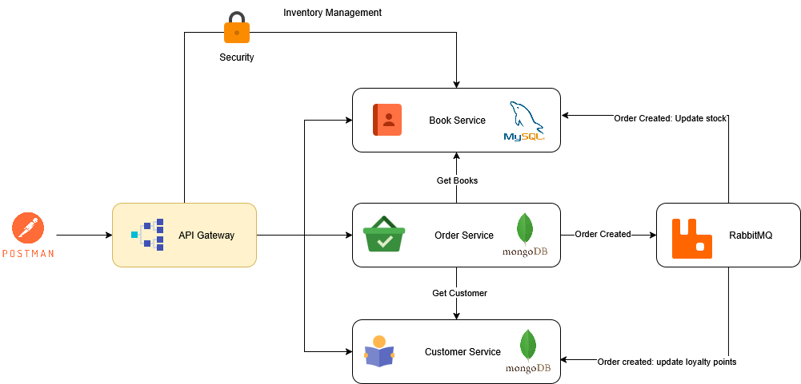
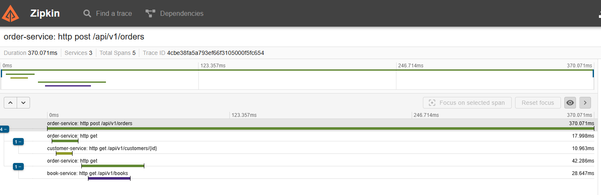
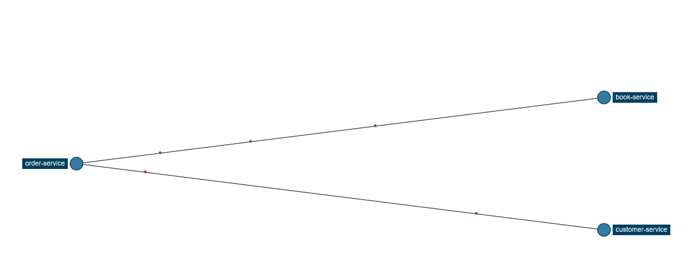
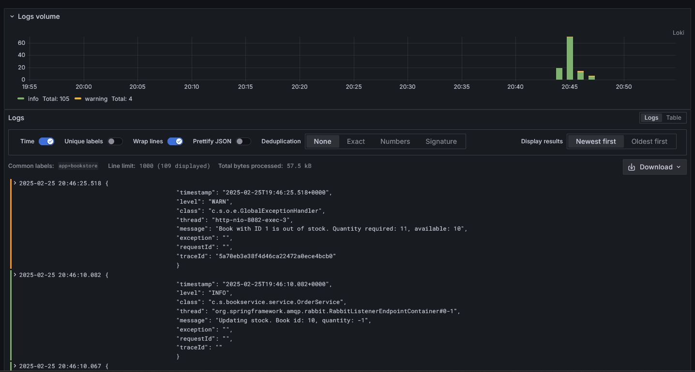
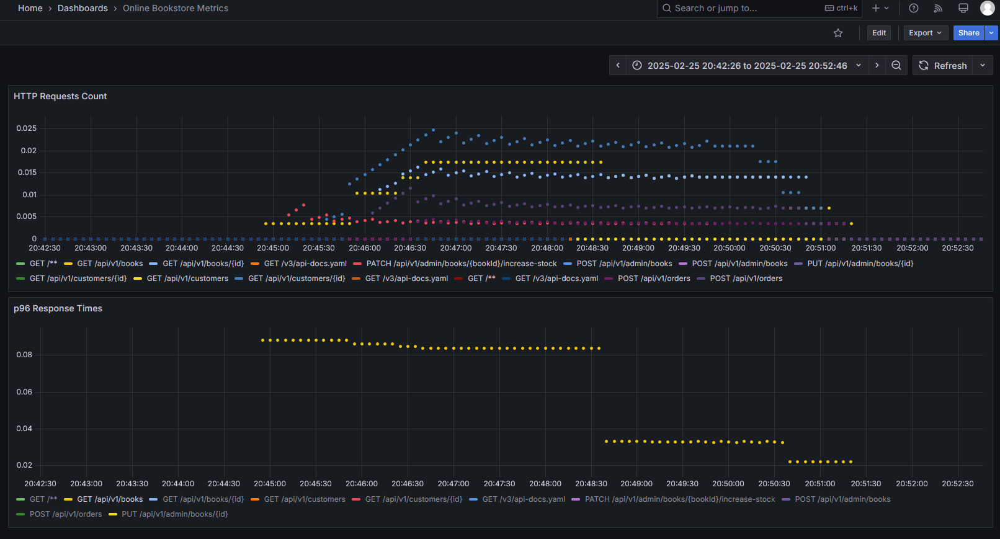

# Online bookstore

## Overview
The **Online Bookstore** is a microservices-based application designed to manage books, orders, and customers. The system uses **Spring Boot** for microservices, **MySQL** and **MongoDB** for data storage, **RabbitMQ** for messaging, **Zipkin** for tracing, and **Grafana & Prometheus** for monitoring.

## Prerequisites
Before running the project, ensure you have the following installed:
- **Docker**
- **Docker Compose**


## Running the project
To start the project, execute the following command in the root directory:

```sh
docker-compose up --build -d
```

This command will:
- Build and start all microservices.
- Start databases, message brokers, and monitoring tools.

## Stopping the project
To stop and remove all containers, use:

```sh
docker-compose down
```

To stop the services without removing them, use:

```sh
docker-compose stop
```


## Architecture
The system follows a microservices architecture, with independent services communicating via REST APIs and asynchronous messaging using RabbitMQ. Below is a high-level architecture diagram:




## Components overview
The system consists of the following components:

### Microservices
- **Book Service** - Manages book inventory.
- **Order Service** - Manages customer orders.
- **Customer Service** - Manages customer details.
- **API Gateway** - Entry point for all microservices, handling routing.

### Databases
- **MySQL** - Relational database for `book-service`.
- **MongoDB** - NoSQL database for `order-service` and `customer-service`.

### Messaging & Monitoring
- **RabbitMQ** - Message broker for communication between services.
- **Zipkin** - Distributed tracing system.
- **Prometheus** - Monitoring and alerting toolkit.
- **Grafana** - Visualization and analytics platform.
- **Loki** - Log aggregation system.


## Accessing services & tools
Once the system is running, you can access the services at the following URLs:

### Microservices
| Service           | URL                        |
|------------------|--------------------------|
| API Gateway      | http://localhost:8080     |
| Book Service     | http://localhost:8081     |
| Order Service    | http://localhost:8082     |
| Customer Service | http://localhost:8083     |

### Tools
| Tool              | URL                        | Login Credentials (if required)                        | Description |
|------------------|--------------------------|--------------------------------------------------------|-------------|
| Adminer (MySQL)  | http://localhost:8088     | Server : mysql, User: `user`, Password: `password` | UI to manage MySQL |
| Mongo Express    | http://localhost:8084     | No login required                                      | UI to manage MongoDB |
| RabbitMQ UI      | http://localhost:15672    | User: `r-user`, Password: `r-password`                 | Message broker management |
| Zipkin UI        | http://localhost:9411     | No login required                                      | Distributed tracing |
| Prometheus       | http://localhost:9090     | No login required                                      | System monitoring and metrics |
| Grafana          | http://localhost:3000     | User: `admin`, Password: `admin`                       | Metrics visualization |

## Observability
Observability is handled through **tracing, logging, and metrics**:


### Distributed tracing
- **Zipkin** (`http://localhost:9411`) enables tracking of requests across services.
- Helps identify bottlenecks and latency issues in microservices communication.





### Logging
- **Loki** aggregates logs from all services.
- Logs can be queried using **Grafana** to monitor application behavior.



### Metrics & Monitoring
- **Prometheus** (`http://localhost:9090`) collects system metrics.
- **Grafana** (`http://localhost:3000`) visualizes metrics with customizable dashboards.
- Helps monitor CPU, memory usage, request latency, and service health.



## API documentation
Each microservice exposes API documentation using **OpenAPI** and **Swagger**. The documentation can be accessed at:

| Service           | OpenAPI Docs URL           | Swagger UI URL                           |
|------------------|--------------------------|-----------------------------------------|
| Book Service     | http://localhost:8081/v3/api-docs | http://localhost:8081/swagger-ui/index.html |
| Order Service    | http://localhost:8082/v3/api-docs | http://localhost:8082/swagger-ui/index.html |
| Customer Service | http://localhost:8083/v3/api-docs | http://localhost:8083/swagger-ui/index.html |

Additionally, a OpenAPI specification is available in:
- [book-service](docs/openapi/book-service/api-docs.yaml)
- [customer-service](docs/openapi/customer-service/api-docs.yaml)
- [order-service](docs/openapi/order-service/api-docs.yaml)

## Design and implementation dcisions

### Microservices architecture
- Each service is independently deployable and scalable.
- Communication between services is done via REST APIs and asynchronous messaging using RabbitMQ.

### API Gateway
- Centralized entry point for handling routing
- Reduces direct exposure of internal microservices.

### Database Choices
- **MySQL** is used for structured relational data in `book-service`.
- **MongoDB** is used for flexible, scalable data storage in `order-service` and `customer-service`.
- MySQL is chosen because the book data model is expected to evolve with more relationships, including:
    - **Categories** - Grouping books into genres.
    - **Authors** - Mapping books to multiple authors.
    - **Reviews** - Storing user-generated reviews and ratings.

### Database changes management
- In the current implementation, changes to the database schema are made by Hibernate
- **liquibase / flyway** could be integrated in the future

### Database initilization
The database is initially fed with data when the application starts by adding:
- 50 random books
- 10 random customers

### Service Discovery
- Currently, services are manually configured via environment variables.
- **Spring Cloud Eureka** could be integrated in the future for dynamic service discovery.

### Authorization
- **JWT-based authentication** is implemented for book management.
- **Missing:** Authorization when placing orders; needs implementation.

### Event-Driven Communication
- RabbitMQ enables event-driven messaging between services, reducing coupling and improving scalability.

### Configurable price calculation mechanism
The price calculation mechanism is configurable by order service properties

```bash
pricing-rules:
  numberOfLoyaltyPointsForFreeBook: 10
  freeBookTypes:
    - REGULAR
    - OLD_EDITION
  discountRules:
    NEW_RELEASE:
      discount: 0
      bundle: 0
      bundleDiscount: 0
    REGULAR:
      discount: 0
      bundle: 3
      bundleDiscount: 10
    OLD_EDITION:
      discount: 20
      bundle: 3
      bundleDiscount: 5
```

### Order creation
Lack of an advanced solution to prevent parallel purchases of books. There is a basic mechanism for checking stock levels, but ultimately this may not be sufficient.  Saga pattern could solve this problem.

## Postman collection
[Postaman collection](docs/postman/BookStore.postman_collection.json)